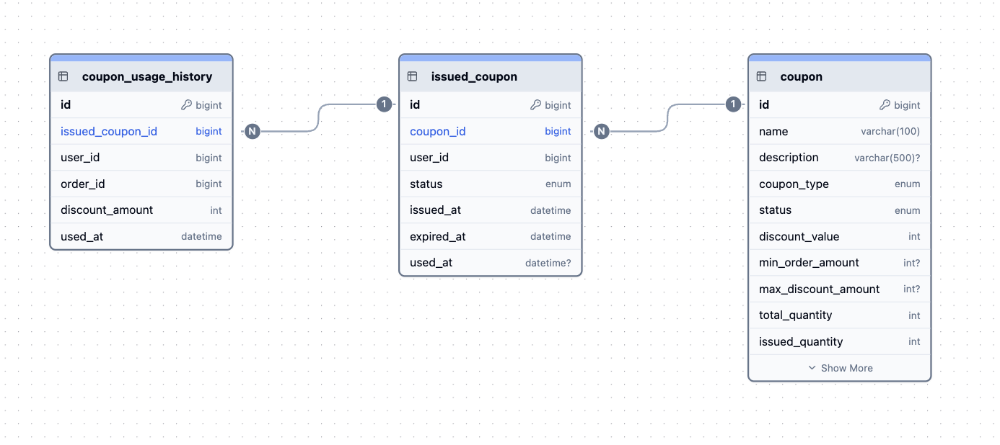

# ConcurrencySafeCoupon

선착순 쿠폰 발급 시스템 — 대규모 동시 요청 환경에서 정확한 수량 제어와 중복 발급 방지를 보장하는 쿠폰 서비스입니다.

---

## DB 구조

ERD

---

coupon — 쿠폰 원본 정보 및 발급 정책

| 컬럼 | 타입 | 설명 |
|------|------|------|
| id | BIGINT | PK |
| name | VARCHAR(100) | 쿠폰명 |
| description | VARCHAR(500) | 설명 (nullable) |
| coupon_type | ENUM | FIXED_AMOUNT / PERCENTAGE |
| status | ENUM | ACTIVE / INACTIVE / EXHAUSTED / EXPIRED |
| discount_value | INT | 할인 값 |
| min_order_amount | INT | 최소 주문 금액 (nullable) |
| max_discount_amount | INT | 최대 할인 금액 (nullable) |
| total_quantity | INT | 총 발급 수량 |
| issued_quantity | INT | 현재 발급 수량 |
| valid_days | INT | 발급 후 유효 일수 |
| start_date | DATETIME | 발급 시작일 |
| end_date | DATETIME | 발급 종료일 |

---

issued_coupon — 사용자에게 발급된 쿠폰 내역

| 컬럼 | 타입 | 설명 |
|------|------|------|
| id | BIGINT | PK |
| coupon_id | BIGINT | FK → coupon.id |
| user_id | BIGINT | 발급받은 사용자 ID |
| status | ENUM | ISSUED / USED / EXPIRED / CANCELLED |
| issued_at | DATETIME | 발급일시 |
| expired_at | DATETIME | 만료일시 |
| used_at | DATETIME | 사용일시 (nullable) |

> `(coupon_id, user_id)` UNIQUE 제약으로 동일 사용자 중복 발급을 DB 레벨에서 방지합니다.

---

coupon_usage_history — 쿠폰 사용 이력

| 컬럼 | 타입 | 설명 |
|------|------|------|
| id | BIGINT | PK |
| issued_coupon_id | BIGINT | FK → issued_coupon.id |
| user_id | BIGINT | 사용자 ID |
| order_id | BIGINT | 주문 번호 |
| discount_amount | INT | 적용 할인 금액 |
| used_at | DATETIME | 사용일시 |

